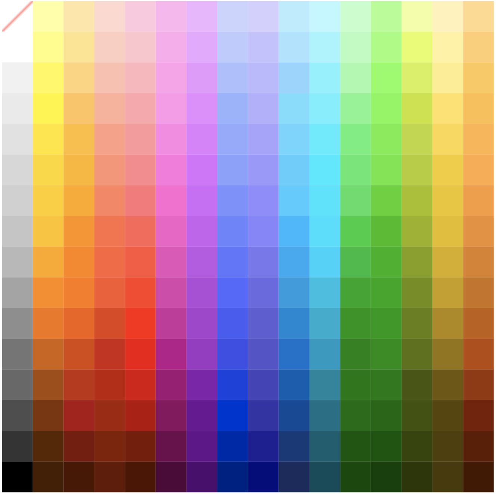

# CryptoCanvas.art Ethereum contract
[](https://travis-ci.com/TheMindhouse/cryptocanvas-solidity)

CryptoCanvas are distributed and collectible community artworks build on Ethereum blockchain. Visit [CryptoCanvas.art][homepage] if you want to become the blockchain picasso, buy crypto art created by the community, or just enjoy what have been already painted. 

This repository hosts solidity code of Ethereum contract and information about it. 

## Using the contract on your local machine

To start using a contract on your local machine you need [truffle](https://github.com/trufflesuite/truffle) and [ganache](https://github.com/trufflesuite/ganache-cli). If you have it installed and running on port _8545_ just use a command: 

`truffle migrate --network dev --reset `

It will put all contracts to a local test environment. 

## Code organization

The code is split into few contracts: 
* `CanvasFactory` - handles creating and drawing on a canvas. Canvas struct is defined over here. 
* `CanvasState` - manages canvases' state. 
* `RewardableCanvas` - handles fees: commissions and rewards. 
* `BiddableCanvas` - handles initial bidding phase: after a canvas is finished until it's bought by the first user. 
* `CanvasMarket` - handles trading canvases.
* `CryptoArt` - the main contract that is put on the main network. Has some util methods. 
* `TimeAware`, `TestableArt` - contracts created for tests. Thanks to them, it's possible to manipulate time in truffle tests.
* `Withdrawable` - handles withdrawals. 

## Interacting with the contract

CryptoCanvas contract is normal Ethereum thus you need to be aware of gas costs. There are two types of interaction with the contract: calls and transactions. Calls are free, transactions require you to pay gas costs. Precise cost may vary depending on the current contract state. You can find detailed cost in the newest build details on [Travis CI](https://travis-ci.com/TheMindhouse/cryptocanvas-solidity). 

This docs skip non public methods or methods dedicated only for the owner of the contract. 

### CanvasFactory 

* `createCanvas() returns (uint canvasId)` - creates a new canvas. Fails if there are too many canvases. 
* `setPixel(uint32 _canvasId, uint32 _index, uint8 _color)` - sets a single pixel. 
* `setPixels(uint32 _canvasId, uint32[] _indexes, uint8[] _colors)` - sets many pixels at once. Be careful - sending a lot of pixels may cause out of gas error. Depending on a gas limit it should be safe to send 100-150 pixels. 
* `getCanvasBitmap(uint32 _canvasId) view returns (uint8[])` - returns canvas' bitmap. 
* `getCanvasPaintedPixelsCount(uint32 _canvasId) view returns (uint32)` - returns how many pixles has been already set. 
* `getPixelCount() external pure returns (uint)` - returns number of pixels in a canvas. 
* `getCanvasCount() view returns (uint)` - returns number of created canvases. 
* `isCanvasFinished(uint32 _canvasId) view returns (bool)` - returns true if cavnas has been finished, false otherwise. 
* `getPixelAuthor(uint32 _canvasId, uint32 _pixelIndex) view returns (address)` - returns an address of the pixel's author. 
* `getPaintedPixelsCountByAddress(address _address, uint32 _canvasId) view returns (uint32)` - returns number of pixels set by given address.

### CanvasState

* `getCanvasState(uint32 _canvasId) view returns (uint8)` - returns 0 if canvas is still being painted, 1 if in initial bidding phase, 2 if already sold. 
* `getCanvasByState(uint8 _state) view returns (uint32[])` - returns ids of canvases in the given state. 
* `setCanvasName(uint32 _canvasId, string _name)` - sets a canvas' name. Can be called only by the canvas' owner. Max 24 characters. 

### RewardableCanvas

* `addRewardToPendingWithdrawals(uint32 _canvasId)` - adds all remaining rewards of the caller to his pending withdrawals. 
* `calculateRewardToWithdraw(uint32 _canvasId, address _address) view returns (uint, uint)` - Calculates unpaid rewards of a given address. Returns amount to withdraw and amount of pixels owned.
* `getTotalCommission(uint32 _canvasId) view returns (uint)` - Returns total amount of commission charged for a given canvas.
* `getCommissionWithdrawn(uint32 _canvasId) view returns (uint)` - Returns total amount of commission that has been already paid (added to pending withdrawals).
* `getTotalRewards(uint32 _canvasId) view returns (uint)` - returns all rewards charged for the given canvas.
* `getRewardsWithdrawn(uint32 _canvasId, address _address) view returns (uint)` - Returns total amount of rewards that has been already paid (added to pending withdrawals) by a given address.
* `splitBid(uint _amount) pure returns (uint, uint)` - Calculates how the initial bidding money will be split. Returns commission and sum of all painters' rewards.
* `splitTrade(uint _amount) pure returns (uint, uint, uint)` - Calculates how the money from selling canvas will be split. Returns commission, sum of painters' rewards and a seller's profit.

### BiddableCanvas

* `makeBid(uint32 _canvasId) payable` - makes a bid for specified canvas. Amount of eth send has to greater than previous bid. Specified canvas has to be in initial bidding phase. 
* `getLastBidForCanvas(uint32 _canvasId) view returns (uint32, address, uint, uint)` - Returns last bid for canvas. If the initial bidding has been already finished that will be winning offer. Returns canvasId, bidder address, amount of Wei, finish time. 
* `balanceOf(address _owner) view returns (uint)` - Returns number of canvases owned by the given address.

### CanvasMarket

* `acceptSellOffer(uint32 _canvasId) payable` - Buys artwork. The artwork has to be put on sale. If the caller has bid before for that artwork, that bid will be canceled.
* `offerCanvasForSale(uint32 _canvasId, uint _minPrice)` - Offers canvas for sale for a minimal price. Anybody can buy it for an amount greater or equal to min price.
* `offerCanvasForSaleToAddress(uint32 _canvasId, uint _minPrice, address _receiver)` - Offer canvas for sale to a given address. Only that address is allowed to buy canvas for an amount greater or equal to minimal price.
* `cancelSellOffer(uint32 _canvasId)` - Cancels previously made sell offer. The caller has to be an owner of the canvas. The function will fail if there is no sell offer or the canvas.
* `makeBuyOffer(uint32 _canvasId) payable` - Places buy offer for the canvas. It cannot be called by the owner of the canvas. A new offer has to be bigger than the existing offer. Returns ethers to the previous bidder, if any.
* `cancelBuyOffer(uint32 _canvasId)` - Cancels previously made buy offer. The caller has to be an author of the offer.
* `acceptBuyOffer(uint32 _canvasId, uint _minPrice)` - Accepts buy offer for the canvas. The caller has to be the owner of the canvas. You can specify a minimal price, which is the protection against accidental calls.
* `getCurrentBuyOffer(uint32 _canvasId) view returns (bool, address, uint)` - Returns current buy offer for the canvas: whether has an offer, buyer's address and an offer's amount. 
* `getCurrentSellOffer(uint32 _canvasId) view returns (bool, address, uint, address)` - Returns current sell offer for the canvas: whether is for sale, seller's address, a minimum amount of Wei and an address of a specified buyer.

### CryptoArt

* `getCanvasInfo(uint32 _canvasId) external view returns (uint32, string,uint32, uint8, uint, address,address)` - returns extra information about the canvas: id, name, painted pixels, canvas state, initial bidding finish time, owner's address and address that painting is booked for. 
* `getCanvasByOwner(address _owner) view returns (uint32[])` - returns ids of canvases that belong to given owner. 
* `getCanvasesWithSellOffer(bool includePrivateOffers) view returns (uint32[])` - Returns array of canvas's ids. Returned canvases have sell offer. If includePrivateOffers is true, includes offers that are targeted only to one specified address.
* `getCanvasPainters(uint32 _canvasId) view returns (address[])` - Returns array of all the owners of all of pixels. If some pixel hasn't been painted yet, 0x0 address will be returned.

## Color palette
CryptoCanvas, due to technical and aesthetic reasons, uses a custom color palette. Each number corresponds to a fixed color. Here is the full-color palette. 

Color `0` represents lack of color. You can think of it as a fully transparent pixel. It's not allowed to set pixel's color as `0`.



### Javascript palette array 
Here is full palette represented by Javascript array. For example color `1` is `#FFFF9E`.

```Javascript
export const hexPalette = [ undefined, '#ffff9e', '#ffe6A3', '#ffd9ce', '#ffc7df', '#ffb4ef', '#efb3ff', '#ccd3ff', '#d4d0ff', '#b6ecff', '#bcf8ff', '#c1fec9', '#A9ff8c', '#efffA0', '#fff3b7', '#ffd98b', '#ffffff', '#feff7d', '#ffe48c', '#ffcec1', '#ffc4ce', '#ffAAee', '#ecA5ff', '#becbff', '#c4c0ff', '#A9e3ff', '#9ff5ff', '#b5fcbe', '#99ff78', '#e3fe5f', '#fff39f', '#ffce6f', '#f1f1f1', '#fffA51', '#ffd479', '#ffbfAf', '#ffb5bc', '#ff9feb', '#e996ff', '#Acbeff', '#bcb7ff', '#91d5ff', '#7ff2ff', '#A0fAAc', '#80ff58', '#d6f151', '#feee8b', '#ffc854', '#eaeaea', '#fff51b', '#ffc45A', '#ffAf99', '#ffA6Ab', '#ff96e9', '#e689ff', '#9bb2ff', '#b3Aeff', '#75dcff', '#68f0ff', '#7bf68e', '#76f94e', '#c8e32A', '#ffe261', '#ffbf49', '#e1e1e1', '#ffe615', '#ffbd30', '#ff9f85', '#ff979b', '#ff84e6', '#e27bff', '#94A8ff', '#A8A2ff', '#67d5ff', '#40edff', '#5bf177', '#6bef42', '#bdd831', '#fAd846', '#ffb446', '#d7d7d7', '#ffd80f', '#ffb618', '#ff9274', '#ff878b', '#ff73df', '#db6dff', '#8d9fff', '#9e96ff', '#55cdff', '#00eAff', '#50e86d', '#62e738', '#b3ce22', '#f3cd20', '#ffAA43', '#d0d0d0', '#ffcf00', '#ffAA00', '#ff8260', '#ff7479', '#ff66d3', '#d264f9', '#7d8fff', '#938Aff', '#40ccff', '#00e5ff', '#43de63', '#4Ad317', '#A6c100', '#ecc60f', '#f99c38', '#c5c5c5', '#ffc300', '#ff9200', '#ff6e47', '#ff6456', '#f55bc8', '#cA5bf1', '#6e81ff', '#8b82ff', '#24b8ff', '#00e0ff', '#00d138', '#2dbe00', '#99b400', '#e4be00', '#ed8f2d', '#b8b8b8', '#ffA700', '#ff8500', '#ff633c', '#ff523A', '#e74dbA', '#bf50e6', '#6372ff', '#7c74f1', '#20A9f2', '#00d3fA', '#00bd3b', '#19b300', '#86A000', '#d6Af00', '#db8122', '#a4a4a4', '#ff8A00', '#ff7900', '#f8572f', '#ff3e21', '#dA3fAd', '#b344dA', '#5964ff', '#6e66e3', '#1f9cdf', '#00bfe2', '#00A71A', '#00A800', '#748e00', '#c7A000', '#cA7315', '#8e8e8e', '#f37400', '#f36000', '#e34113', '#ff1c00', '#c92c9d', '#A93Ad0', '#4e56f5', '#625Ad6', '#0087d5', '#00Aece', '#009500', '#009b00', '#678000', '#b08A00', '#c15f0A', '#757575', '#d06200', '#d74700', '#ce2412', '#f20000', '#b9008c', '#9f2fc6', '#4448e7', '#5950cc', '#0071cd', '#009bc3', '#008300', '#008f00', '#5b7200', '#947500', '#b74A02', '#686868', '#A44b00', '#c12d0c', '#be1d00', '#d90000', '#A20077', '#850fAd', '#2439dd', '#483fbb', '#005cb2', '#00869f', '#007800', '#007A00', '#465700', '#6f5700', '#973400', '#4e4e4e', '#7e3300', '#Ac0e12', '#A41f00', '#b60000', '#8b0061', '#6e0096', '#012Ad3', '#372eA9', '#094897', '#007086', '#006d00', '#006800', '#405300', '#564500', '#791d00', '#343434', '#5A2600', '#7b1306', '#841b00', '#7b1500', '#6f004d', '#65008d', '#0122Ac', '#231794', '#15387A', '#005e70', '#005600', '#005500', '#354500', '#4f3f00', '#5f1A00', '#000000', '#461e00', '#4A1600', '#641903', '#501200', '#500038', '#4f0070', '#011b86', '#0f007e', '#1b295d', '#004c5A', '#004A00', '#004100', '#2A3600', '#483A00', '#451700' ]


```

[homepage]: https://www.cryptocanvas.art
