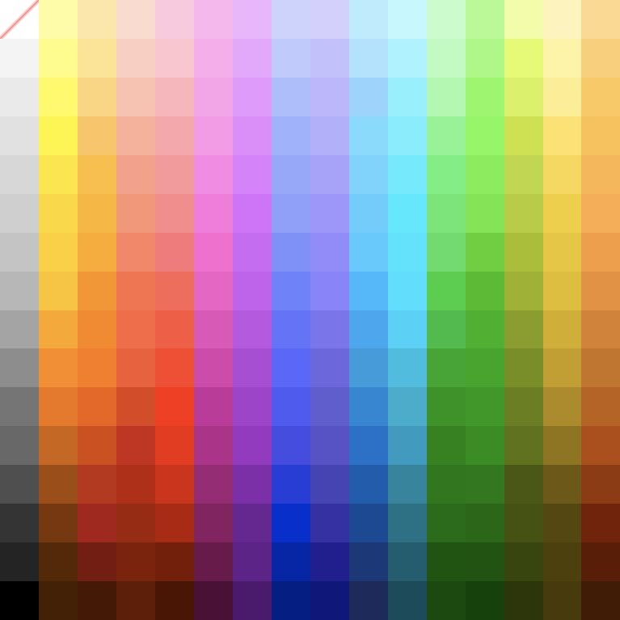

# CryptoCanvas.art Ethereum contract
CryptoCanvas are distributed and collectible community artworks build on Ethereum blockchain. Visit our website [CryptoCanvas.art][homepage] if you want to become a crypto artist, buy crypto art created by the community, or just enjoy what have been already painted. 

This repository hosts solidity code of Ethereum contract. Because of that, you can find here technical information about the contract itself. If you seek more information about the project visit our [website][homepage] or read [whitepapper](https://github.com/TheMindhouse/cryptocanvas-solidity/blob/master/whitepaper.pdf).

## Interacting with the contract

CryptoCanvas contract is normal Ethereum thus you need to be aware of gas costs. There are two types of interaction with the contract: calls and transactions. Calls are free, transactions require you to pay gas costs. Costs, if any, are specified in the description below. 

* `createCanvas()`, gas cost: xxx (TBD)

    Creates a new canvas. Anybody can call this function, but there are some limitations. First of all, count of canvases can't exceed `MAX_CANVAS_COUNT`. Secondly, it's not allowed to create new canvas when there is more than `MAX_ACTIVE_CANVAS` unfinished canvases. 

* `function setPixel(uint32 _canvasId, uint32 _index, uint8 _color) returns (uint cooldownTime)`, gas cost: xxx

    Sets the color for specified canvas. Color has to be different than `0`. Address cooldown is defined by `ADDRESS_COOLDOWN`, which means you have to wait that time to set another pixel. It returns time after which address can set next pixel. Color mapping is described in [this](#color-palette) section.

* `getArtwork(uint32 _canvasId) returns (uint8[])`, free to call

    Returns the bitmap of a canvas. `0` color means that pixel is not set. Color mapping is described in [this](#color-palette) section. 

* `getArtworkPaintedPixels(uint32 _canvasId) returns (uint32)`, free to call

    Returns number of pixels that have been already painted.

* `getPixelCount() returns (uint)`, free to call

    Returns total number of pixels in canvas. 

* `getArtworksCount() returns (uint)`, free to call

    Returns the total number of created canvases. 

* `isArtworkFinished(uint32 _canvasId) returns (bool)`, free to call

    Returns `true` if the canvas is finished, `false` otherwise. Canvas is finished when all of its pixels have been set.

* `makeBid(uint32 _canvasId)`, gas cost: xxx

    Use this function to participate in the initial bidding. It's only possible to call this function when the state of the canvas is equal to `STATE_INITIAL_BIDDING`. Amount of ethers has to be higher than greater than `MINIMUM_BID_AMOUNT` and last highest bid.

    If you will be overbid, the contract will send you back money that you paid. 

* `getLastBidForCanvas(uint32 _canvasId) returns (address bidder, uint amount, uint finishTime)`, free to call

    Returns last bid made for canvas. If the state of the canvas is equal to `STATE_OWNED` that simply is the price that this canvas was sold. 

* `getCanvasState(uint32 _canvasId) returns (uint8)`, free to call

    Returns the current state of the canvas. There are 3 states possible: 
    1. `STATE_NOT_FINISHED = 0` - state when canvas is not yet finished. 
    2. `STATE_INITIAL_BIDDING = 1` - state when canvas has been already finished, but initial bidding is still in progress. It means everybody can bid right now. 
    3. `STATE_OWNED = 2` - state after initial bidding is finished. Canvas has its owner who decides when to trade it. 

* `withdrawReward(uint32 _canvasId)`, gas cost: xxx

    Get paid for what you've painted. Only possible when the state is equal to `STATE_OWNED`. It's possible to get paid just once ;)

* `balanceOf(address _owner) returns (uint)` 

    Returns the amount of canvases assigned to the address. 

* `buyArtwork(uint32 _canvasId)`, gas cost: xxx

    Buy the canvas. There has to be sell offer for the artwork. Amount of transferred ethers has to be equal or greater than minimum price set in sell offer. 

* `offerArtworkForSale(uint32 _canvasId, uint _minPrice)`, gas cost: xxx

    Offer your canvas for sale. 

* `function offerArtworkForSaleToAddress(uint32 _canvasId, uint _minPrice, address _receiver)`, gas cost: xxx

    Offer your canvas for sale. Only specified address can buy the canvas. 

* `artworkNoLongerForSale(uint32 _canvasId)`, gas cost: xxx

    Cancels all sell offers. You have to be owner of the canvas. 

* `enterBuyOffer(uint32 _canvasId)`, gas cost: xxx

    Place buy offer for the canvas. Amount of transferred ethers has to be greater than highest buy offer. Owner of the canvas has to accept buy offer. 

* `cancelBuyOffer(uint32 _canvasId)`, gas cost: xxx

    Cancel buy offer that you've previously placed. 

* `acceptBuyOffer(uint32 _canvasId, uint _minPrice)`, gas cost: xxx

    Accept current buy offer for your canvas. To protect you from accidental calls, you have to specify minimum price. 

* `getCanvasInfo(uint32 _canvasId) public view returns (uint32 id, uint32 paintedPixels, bool isFinished, uint8 canvasState, address owner)`, free to call 

    Returns useful information about canvas, all packed in one handy function. 

* `calculateReward(uint32 _canvasId, address _address) returns (uint32 pixelsCount, uint reward, bool isPaid)`, free to call

    Calculates reward for an address. Returns: 
    * number of pixels that given address painted 
    * reward in weis
    * information if reward has been already paid. 

* `calculateCommission(uint32 _canvasId) public stateOwned(_canvasId) returns (uint commission, bool isPaid)`, free to call

    Returns commision for given cavas and information if it has been already paid.

## Color palette
CryptoCanvas, due to technical and aesthetic reasons, uses a custom color palette. Each number corresponds to a fixed color. Here is the full-color palette. 

Color `0` represents lack of color. You can think of it as a fully transparent pixel. It's not allowed to set pixel's color as `0`.



### Javascript palette array 
Here is full palette represented by Javascript array. For example color `1` is `#FFFF9E`.

```Javascript
var hexPalette = ['#FFFFFF', '#FFFF9E', '#FFE6A3', '#FFD9CE', '#FFC7DF', '#FFB4EF', '#EFB3FF', '#CCD3FF', '#D4D0FF', '#B6ECFF', '#BCF8FF', '#C1FEC9', '#A9FF8C', '#EFFFA0', '#FFF3B7', '#FFD98B', '#F4F4F4', '#FEFF7D', '#FFE48C', '#FFCEC1', '#FFC4CE', '#FFAAEE', '#ECA5FF', '#BECBFF', '#C4C0FF', '#A9E3FF', '#9FF5FF', '#B5FCBE', '#99FF78', '#E3FE5F', '#FFF39F', '#FFCE6F', '#EAEAEA', '#FFFA51', '#FFD479', '#FFBFAF', '#FFB5BC', '#FF9FEB', '#E996FF', '#ACBEFF', '#BCB7FF', '#91D5FF', '#7FF2FF', '#A0FAAC', '#80FF58', '#D6F151', '#FEEE8B', '#FFC854', '#E1E1E1', '#FFF51B', '#FFC45A', '#FFAF99', '#FFA6AB', '#FF96E9', '#E689FF', '#9BB2FF', '#B3AEFF', '#75DCFF', '#68F0FF', '#7BF68E', '#76F94E', '#C8E32A', '#FFE261', '#FFBF49', '#D7D7D7', '#FFE615', '#FFBD30', '#FF9F85', '#FF979B', '#FF84E6', '#E27BFF', '#94A8FF', '#A8A2FF', '#67D5FF', '#40EDFF', '#5BF177', '#6BEF42', '#BDD831', '#FAD846', '#FFB446', '#D0D0D0', '#FFD80F', '#FFB618', '#FF9274', '#FF878B', '#FF73DF', '#DB6DFF', '#8D9FFF', '#9E96FF', '#55CDFF', '#00EAFF', '#50E86D', '#62E738', '#B3CE22', '#F3CD20', '#FFAA43', '#C5C5C5', '#FFCF00', '#FFAA00', '#FF8260', '#FF7479', '#FF66D3', '#D264F9', '#7D8FFF', '#938AFF', '#40CCFF', '#00E5FF', '#43DE63', '#4AD317', '#A6C100', '#ECC60F', '#F99C38', '#B8B8B8', '#FFC300', '#FF9200', '#FF6E47', '#FF6456', '#F55BC8', '#CA5BF1', '#6E81FF', '#8B82FF', '#24B8FF', '#00E0FF', '#00D138', '#2DBE00', '#99B400', '#E4BE00', '#ED8F2D', '#A4A4A4', '#FFA700', '#FF8500', '#FF633C', '#FF523A', '#E74DBA', '#BF50E6', '#6372FF', '#7C74F1', '#20A9F2', '#00D3FA', '#00BD3B', '#19B300', '#86A000', '#D6AF00', '#DB8122', '#8E8E8E', '#FF8A00', '#FF7900', '#F8572F', '#FF3E21', '#DA3FAD', '#B344DA', '#5964FF', '#6E66E3', '#1F9CDF', '#00BFE2', '#00A71A', '#00A800', '#748E00', '#C7A000', '#CA7315', '#757575', '#F37400', '#F36000', '#E34113', '#FF1C00', '#C92C9D', '#A93AD0', '#4E56F5', '#625AD6', '#0087D5', '#00AECE', '#009500', '#009B00', '#678000', '#B08A00', '#C15F0A', '#686868', '#D06200', '#D74700', '#CE2412', '#F20000', '#B9008C', '#9F2FC6', '#4448E7', '#5950CC', '#0071CD', '#009BC3', '#008300', '#008F00', '#5B7200', '#947500', '#B74A02', '#4E4E4E', '#A44B00', '#C12D0C', '#BE1D00', '#D90000', '#A20077', '#850FAD', '#2439DD', '#483FBB', '#005CB2', '#00869F', '#007800', '#007A00', '#465700', '#6F5700', '#973400', '#343434', '#7E3300', '#AC0E12', '#A41F00', '#B60000', '#8B0061', '#6E0096', '#012AD3', '#372EA9', '#094897', '#007086', '#006D00', '#006800', '#405300', '#564500', '#791D00', '#252525', '#5A2600', '#7B1306', '#841B00', '#7B1500', '#6F004D', '#65008D', '#0122AC', '#231794', '#15387A', '#005E70', '#005600', '#005500', '#354500', '#4F3F00', '#5F1A00', '#000000', '#461E00', '#4A1600', '#641903', '#501200', '#500038', '#4F0070', '#011B86', '#0F007E', '#1B295D', '#004C5A', '#004A00', '#004100', '#2A3600', '#483A00', '#451700'];

```

[homepage]: https://www.cryptocanvas.art